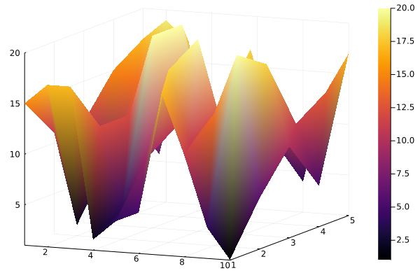
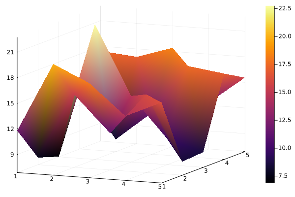
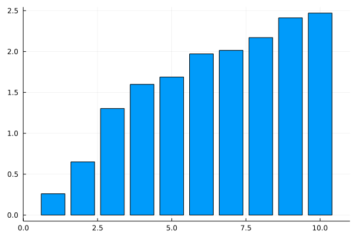

# Simple Model

Example of a simple model using some of the stylistic conventions I prefer in
Julia. Includes some parts of the modeling process I have come to appreciate:

1. Descriptive Analytics of input data
2. Descriptive Analytics of output data
3. Flexibility to handle changes input data

## Input Data

The input data is generated randomly, but we include the distributions package
to be able to sample from specific distributions that would make sense for the
paramters we are sampling for. I include a simple example of getting
`weight_data` from a `Normal` distribution. I plot the values of these input
values somewhat arbitrarily in 2-d space show below:

### Capacity

### Profit

### Weight

## Output/Solution Graphic

For this simple knapsack problem the fundamental relationship we exploit in the
optimzation is the greated profit per weight. We can get an idea of where most
of our gains come from with a graph that plots that relationship shown below:

